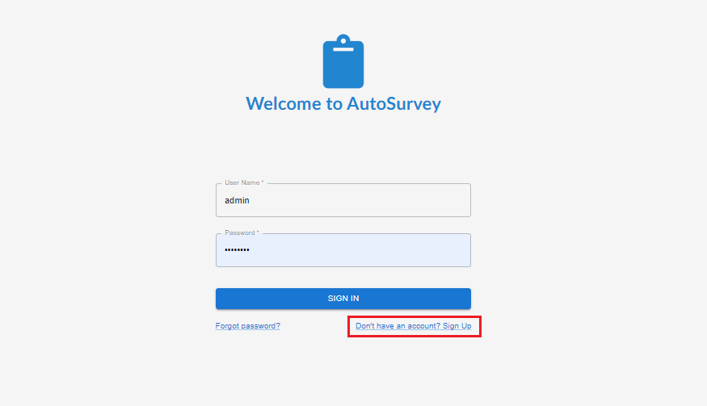
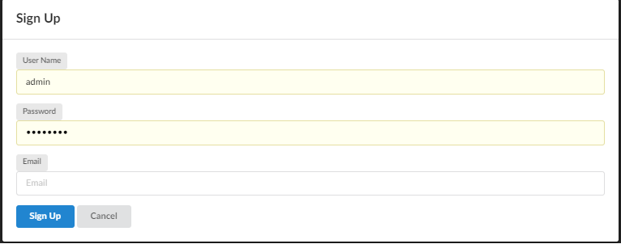
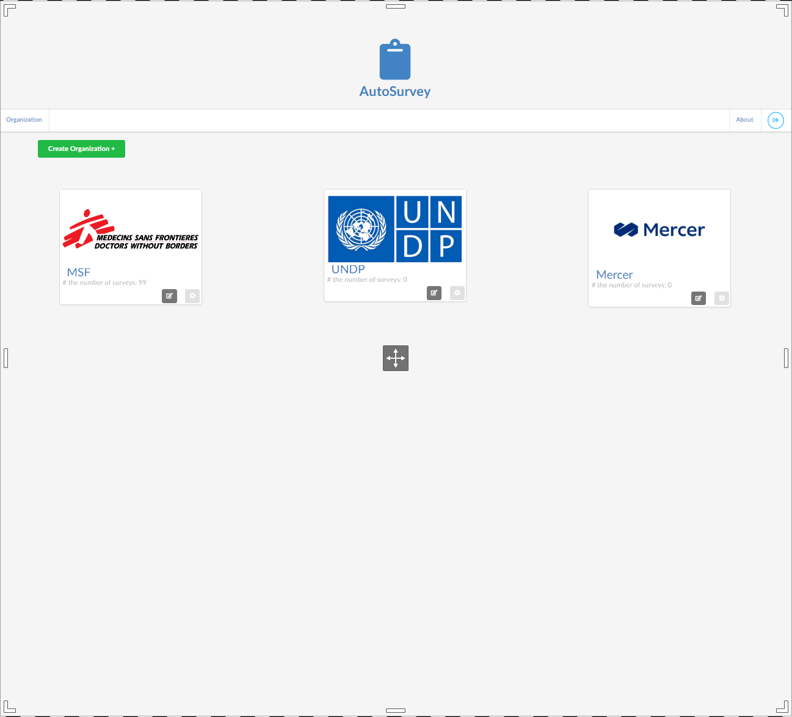
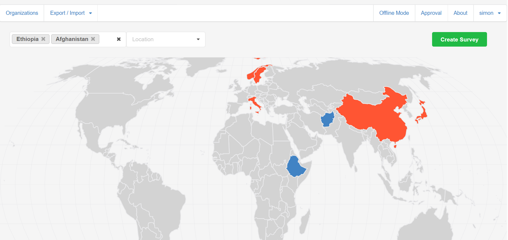
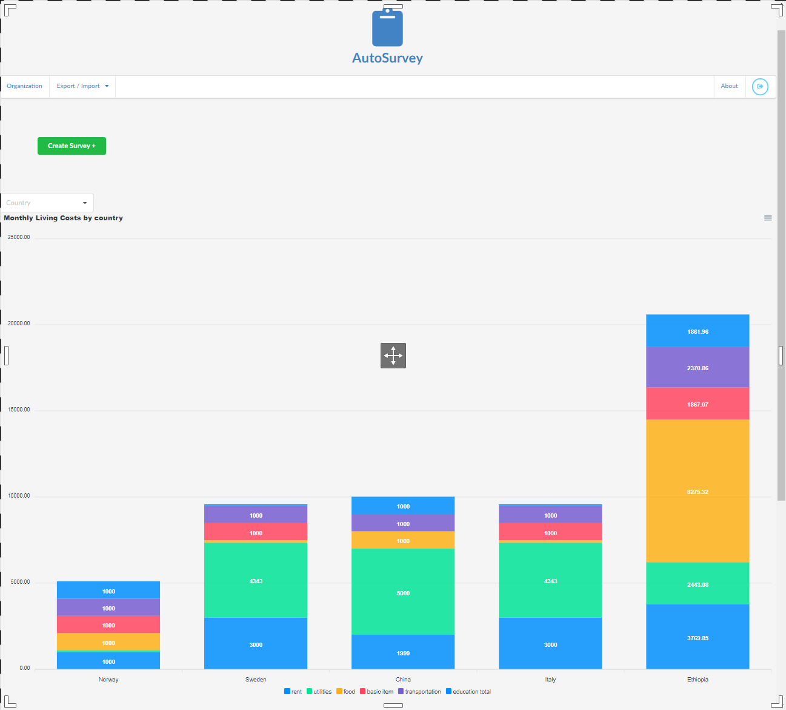
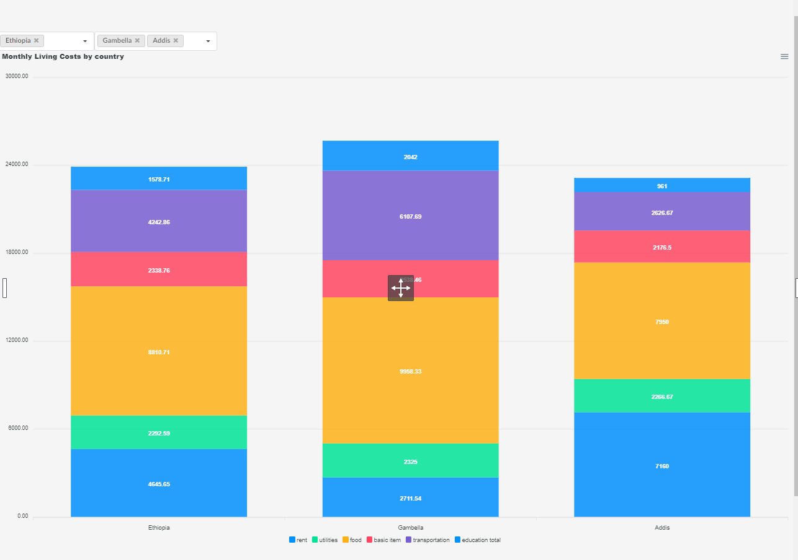
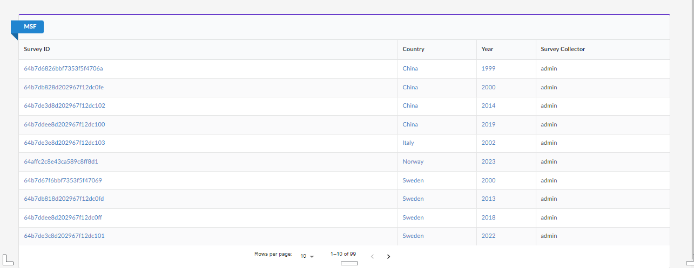

# Autosurvey Project

## Introduction 
Project AutoSurvey aims to help NGO to retrieve data from different surveys and use them globally in an automated way reducing the time and resources needed. Having one standardized entry point for data collection increases the efficiency and it’s less prone to human error due to field validation.

## Project Board

- Check out our board: https://github.com/orgs/AutoSurv/projects/1

**Pitch Deck and Demo**  

##  Table of content
- [How to run the application](#how-to-run-the-application)
- [The application](#the-application)
- [Tech stack and frameworks](#tech-stack-and-frameworks)
- [About us](#about-us)

## How to run the application:
- Click on the vercel link: https://autosurvey.vercel.app/
  or
- After cloning the repository, install all the dependencies: npm install
- Be sure that autosurvey-backend is running (see https://github.com/AutoSurv/autosurvey-backend readme)
- Run the application: npm run dev

## The Application

### Landing page / login form:
- When landing on the page, user must sign up:
  
  
- After signing up the user can sign in

### Organizations page
- In the Organizations page:
  - Managers can create new organizations
  - User and Managers can access to the organizations they are part of
  

### Surveys Page
- In the Surveys page:
  - User and Managers can visualize map from all the surveys  
    

  - User and Managers can visualize the core statistics from all the surveys  
    
  - User and Managers can use filters to focus on a specific year/country/city  
    
  - User and Managers can access the specifi survey from the table  
    

### Survey Details page
- In the Surveys Details page:
  - User and Managers can visualize the data from the surveys  
    
  - User and Managers can delete or modify the selected survey  

## Tech stack, Frameworks and libriaries
### Tech
  - Java
  - TypeScript
  - MongoDb
  - PostgreSQL

### Frameworks
  - Spring Boot / Web
  - Next.js 

### Libraries
  - Spring security
  - Apex Charts 
  - Semantic UI 

## About us
  - Simon: 
           
  

  - Marco: 
           
  

